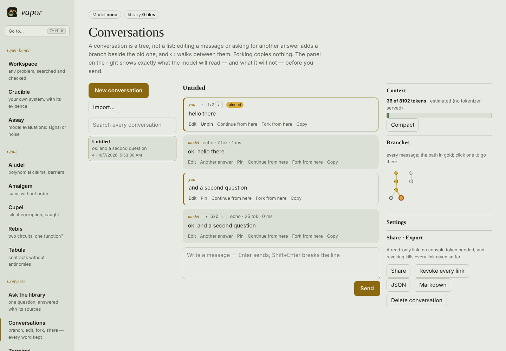
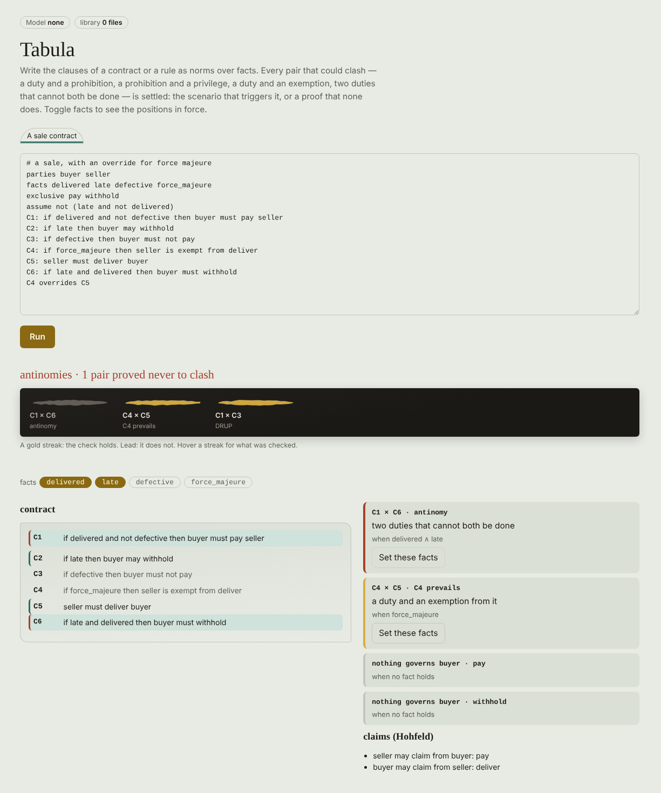
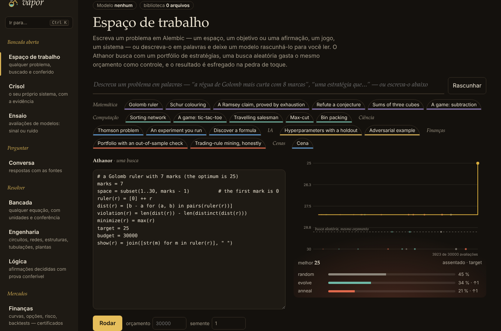

<p></p>

# vapor

A compiler and runtime for certified tensors, written in Elixir with
`deps: []`, and a whole LLM ecosystem on top of it. Programs are
terms of a symbolic algebra; the control plane on the BEAM rewrites them
(exact rules only), allocates vector registers with a linear scan whose
result is checked by a checker proved in Lean, and emits **bits**
directly — x86-64 AVX2 and AVX-512, AArch64 NEON, RV64GCV (RVV 1.0) and
SPIR-V — with no C, no external assembler, no LLVM. The generated code never runs
inside the BEAM: it runs in isolated processes (`vapor-worker`, `vapor-fabric`)
that can die without bringing anything down. Every compilation goes through a
six-rung verification ladder and comes out with a deterministic Ed25519 certificate,
co-signable by independent nodes.

The central guarantee: under the canonical policy, **every substrate produces the same
bits** — x86, ARM, RISC-V (VLEN 128–512), GPU via Vulkan and the exact oracle —
and those bits do not depend on how many threads there are, on how many sequences share
the step, on where the KV cache lives, on which replica serves, nor on whether the weight is
in f32 or bf16 (over the same values).

Since 0.4.0 the core **knows no model family**: every checkpoint
enters through a **model airlock** (`Vapor.Lock`) that turns it into a
contract and a checked program; adding a family costs anything from a JSON
file to a topology adapter. On the same algebra — without any new
operator — vapor loads **image and audio** (bidirectional encoder, Hugging
Face ViT, certified spectrum, VQ codecs, projectors, *soft
token* injection, any-to-any hub), **merges models** with a signable receipt, **measures whether
what comes out is signal or noise** with gates calibrated against controls, **reads
files** — zip, PDF, Office, EPUB, HTML, images — through a document
airlock that gives each passage the path to its page and the hash of its file, and
ships a built-in **web console** where each answer appears beside its
evidence.

Since 0.5.0, the limitations that 0.4.0 declared were attacked one by one: the
new adapters are checked against **`transformers` itself** (which
found a real partial-rotary bug, admitted and silently computed
wrong), the any-to-any routes run on **real held-out data** (handwriting
in both directions by **diffusion**, speech from a voice never heard), there is **OCR**
as a model admitted by the airlock and a **JPEG decoder** identical to
libjpeg bit for bit, merging became **20× faster with the same bits** and gained
**diagnosis and selection by measurement**, and the console speaks **English and Portuguese**
(and has a face in the terminal, `mix vapor.tui`).

Since 0.6.0, vapor serves **frontier models without trading bits for
speed**: **sparse** MoE by row predication (bits = dense, 2.6× in
decode), the MLA **latent** cache (85× less memory), exact sliding window
with a **circular cache** in the block table (7.9× more sequences at
32 k), **Mamba** with state kept in the worker (constant cost per token),
**tree speculation** over shared pages (output = the target's greedy
output) and **exact tensor parallelism**. It gained **convolution without a convolution
kernel**, the diffusers **VAE** and **DiT**, **cross-attention** and
**Whisper**, all checked against the references; `÷` became **IEEE** on
every substrate (semantics v2), **Higham**'s lemma is proved in Lean, and
attestations can be **anchored in a transparency log** (RFC 9162 +
C2SP) that the browser itself verifies.

Since 0.7.0, vapor reads **the office scanned document** from end
to end: *scanner* PDFs in **CCITT Group 3/4** (bit for bit equal to libtiff),
LZW and RunLength; pages of **two and three columns in reading order**; and a
**language model** in decoding that cuts the reader's errors and **abstains
where there is no language** — with the controls that prove both things. Structured
output now obeys JSON Schema **`pattern` and `format`**
(dates with the real calendar, UUID, IPv4, e-mail…), model merging runs
**disk to disk** with the same bytes, and the console shows the reading
order and *who decided each letter*.

Since 0.8.0, the engine **serves on the GPU** with resident sessions in Vulkan
(10–12 ms/token against 72 without a session, 8 kB per token instead of 1 MB, the
CPU's bits), the **4-bit** experts skip the rows not chosen with the
same bits, **Mamba-2** enters through the airlock checked against
`transformers` (and with a divergence between it and the training code found and
measured), and exact tensor parallelism crosses **nodes of an Erlang
cluster** — with *failover* that does not change a bit and replicas compared bit for
bit. Reading scans is completed with **tables** (structure, merged
cells, typed columns; Markdown, HTML, CSV) and **JBIG2** (bit for bit
equal to jbig2dec). The rewrite rules are **proved in Lean** in a
bit-level IEEE-754 model — and the proof corrected a false claim about NaN. And
all this evidence becomes a signed **audit dossier**, which is checked
offline (in the terminal, in the PDF or in the browser) and shows which provisions
of the European AI Act and of ISO/IEC 42001 each piece refers to — and where there is
none.

Since 0.9.0, there is a **studio**: graphs of typed nodes for image, sound,
video, 3D, diffusion and reinforcement learning, in the spirit of ComfyUI, but
with an **exact content-addressed cache** (change a parameter and only what depends on it
runs again) and a **Merkle root per run** that anyone
re-runs to check. ComfyUI workflows are imported in the
translatable subset, with every translation declared. **Stable Diffusion** enters through the
airlock (U-Net, VAE, CLIP, DDIM/Euler/DPM++ 2M; text → image, image →
image, inpainting) and is **equal to diffusers to ~10⁻⁶**. A **consistent
upscaler** guarantees that downscaling the result gives back the input, and wins by
+1.5 to +5.8 dB on text. There are RL policies trained as programs (CartPole
balances 473 of 500 steps) and closed 3D meshes exported as
GLB. For agents, an **MCP server** whose cache lives between calls and whose
results verify themselves. And, in the console, the node canvas with the seal of each
run.

Since 0.10.0, a new accelerator computes only after being **measured**: the
**substrate airlock** runs probes with known answers and returns a
signed admission — canonical, within the proved error envelope (with the
numerical fingerprint: FMA, FTZ/DAZ, summation order, mantissa bits) or
refused. Through it come **Metal** (MSL translator and daemon, tested through a
header *shim*, not on a Mac), **Tenstorrent** and any PJRT (StableHLO
export and a portable admission kit, run on CPU XLA) and
**FreeBSD** (worker with Capsicum; compiled, not executed). **Pre-training**
of a byte-level Llama runs as vapor programs with data parallelism that
does not change a bit with the number of workers, and **endless context** (anchors
+ window, re-based RoPE) reads 14× the training length at 3.03 bits/byte
against 5.81 for the control. There is a **physics engine** (XPBD) for RL and
**digital twins** — the chaotic double pendulum with the same bits on every
substrate, parameter identification by gradient through the simulator,
a twin that raises an alarm 18 steps after a 0.5 % fault and whose log can be
rebuilt —, **complex networks** in which every claim comes with its null
model, and OCR now reads **Arabic** (bidi checked against python-bidi),
**Cyrillic**, **Chinese, Japanese and Korean**, **charts** (the data back,
or a refusal — never an invented number) and **formulas** (LaTeX). Handwriting
remains refused, with the measurement that refuses it.

Since 0.11.0, vapor **discovers and proves**, always with a search that proposes
and a verifier that decides: optimal sorting networks certified by the
0-1 principle, a 2×2 product with 7 multiplications checked over the integers,
minimal bit tricks by exhaustion; geometry theorems by the
algebraic method (Euler line, nine points, Pappus, Simson) — and **conjectures
found without being asked for** —, homology with torsion. **Science** goes from the
quantum coherent state to the equilibrium of a **tokamak** (Solov'ev), to
the Hartree–Fock of H₂ (−1.1167 hartree, the textbook value), to the fixation of
mutants, to phylogeny and to HP folding, each one against its reference.
A small **self-play** agent (policy + value + PUCT) learned tic-tac-toe only by playing against itself and does not
lose any of the optimal lines of perfect play with 128 simulations per move (with 8, it loses 13 % of them, against 97 % for the untrained search); policies trained in varied worlds
withstand worlds they have not seen. And **any picture comes to life**: layers
with the background reconstructed, camera, inhabitants who walk on the ground, weather,
light and wind, drawings animated by skeleton, all **directed in
words**, reproducible from the seed and exported as a page that plays
offline; a sketch becomes a technical drawing (SVG/DXF) or a 3D plan (GLB).
Everything **saves** as a verifiable archive — and, when deterministic,
recomputable.

Since 0.12.0, vapor **solves the problem the user writes**, not
a list of demonstrations: the **workbench** reads equations with units
(checked before running), stiff ODEs, PDEs verified by manufactured
solution, systems, fits and optimization with KKT, and spreads the
uncertainty over 4096 copies compiled for the native worker (53× the BEAM);
**engineering** reads SPICE netlists, bus lists, frames, FEM
meshes, pipe networks and reactions, and returns with every answer a
**certificate computed outside the solver** (Kirchhoff, mismatch,
equilibrium, continuity, stoichiometric invariants); **logic**
decides claims with a checkable proof (SAT with DRUP refutation, Schur,
van der Waerden, Ramsey, Knuth–Bendix, Gröbner) and **checks anyone's
proposal**, including that of a language model over MCP; the
**boards** have chess, shogi and Go pinned by perft and published
counts, checked mate proofs, k-in-a-row solved and poker by
CFR+ with exact exploitability; **proteins** have the field's
metrics (equal to TM-align), folding from contacts and contacts from
coevolution, with the honest comparison against the state-of-the-art predictors; and the
**render** traces light physically on the viewer's GPU, with a
reference that passes the furnace test (and, since 0.17, draws the same scene in ink). All in the console — alphabetical navigation, command
palette — and over MCP.

Since 0.13.0, vapor takes its principle — **every number with what
allows judging it** — to the market, where the pain is verifiability, not
speed. **Finance**: exact decimal money; ANBIMA/B3,
NYSE and TARGET calendars by rules **equal to QuantLib day by day from 1990 to 2078**;
DI1/LTN/NTN-F curves and swaps with every instrument repriced; options
(BSM, Heston, trees) equal to QuantLib, with the no-arbitrage
bounds checked before solving and the SVI smile with butterfly
arbitrage pointed out; **Monte Carlo compiled for the worker with the
generator inside the program** — the bits of the oracle and of two threads, 6–23×
the BEAM; VaR with Kupiec and Christoffersen; and **backtests with four noise
gates**, among them a certificate of **no look-ahead** by
prefix invariance. **Arbitrage is decided exactly** by Farkas's
lemma: a portfolio or state prices, in rationals, checked by
whoever wants to — and the desk accepts anyone's proposal, including that of a
model over MCP. On the **trading desk**, an order book whose
journal is chained by SHA-256 and closed by Merkle, judged by an
**independent naive engine** (which found a real bug), ITCH 5.0, FIX 4.4,
pre-trade risk, Hawkes, Avellaneda–Stoikov and Almgren–Chriss, and an
exchange session in which **the backtest is the exchange's code**. From the list of
open items: rational simplex with a Farkas certificate,
**signed** archives, °C/°F as readings and MOSFET/bipolar **equal to ngspice**.
And the project began to **defend itself**: a thesis in abnTeX2 and the
script of the oral defence.

Since 0.14.0, vapor stops being a showcase and becomes an **open workbench**: instead
of choosing among ready-made problems, the person (or a model) **writes
the problem** in Alembic, a pure and sanitized language — fuel at every
step, size ceilings, a process with a memory ceiling, no atom created.
**Athanor** searches anything written in it with a portfolio of
strategies (exhaustive, annealing, MAP-Elites, CMA-ES, Bayesian, the
model and the person) against **random search with the same budget**, and
returns a certificate that **Touchstone** re-checks without trusting the search
(R(3,3) = 6 proved over 32,768 graphs; Euler's conjecture refuted in
40; *trading* rules unmasked by the *holdout*). **Crucible** takes
the person's system and answers with evidence that needs no answer key
(conservation laws **proved over ℚ**, observed order, theorems that
hold for any input). **Assay** answers the most common question of
AI research — *is this difference real?* — with power, ties, calibration
against its floor and scaling laws that must predict the largest runs.
Everything also from the terminal, Unix-style (JSON in *pipes*, exit
codes with meaning), over MCP and through the TUI; the console gained an identity
of its own in which the furnace is the chart of the search and the touchstone is the
verdict.

Since 0.17.0, vapor **builds where you build it** and **renews what it serves**. The flake and
the code compile cleanly on the current nixpkgs (Elixir 1.18, OTP 28, Zig 0.16), and the Lean
development runs on Lean 4.34 here, where it can now check Almizan's exports. English is the
project's default language. A **hermetic seal** contains every job on untrusted input and counts
the off-heap binaries the 0.16 sandboxes let through. The logic desk decides **integer programs**,
with a tree any reader can check, and **causal claims** on a stated diagram (the ID algorithm:
the estimand, or a hedge), also an Almizan root. **Palingenesis** renews a model plank by plank
through a Fisher–Rao drift brake and a paired target test, publishes each generation without
disturbing a reader, and keeps a signed lineage. **Qālib** reads the netlists of the open sky130 flow
and proves them equal to their specification, or finds the input that tells them apart.
**Recommend** absorbs this repository's SVD script and gives its RMSE the baselines, test and control
it lacked. Alembic files are `.nbq`; Mīzān is now **Almizan**.

The same round admits **Kimi K3** (delta-rule attention, latent attention without positions,
attention residuals, an 896-expert latent mixture in MXFP4) against an independent reference written
from its report, and finds that the report's balancing algorithm, as written, does not balance. The
network has one door, the **siphon**: fetchers the person declares and runs, which an agent can only
ask for. Modules are named for what they compute; product names live in the airlock's spellings. The
living scene, a toy, is gone; the renderer that replaces it draws a scene with physical light or in
**ink**. `mix vapor.test` reruns only the test files whose reach changed. And vapor has a small
editor of its own, **Al-Qalam** (`vapor qalam`): vi keys, each claim's verdict in the gutter, and
numbers you scrub until a law starts or stops holding.

- Round 0.17 — the build, English, the seal **[docs/HERMETIC.md](docs/HERMETIC.md)** · integer programs and causes **[docs/LOGIC.md §6–§7](docs/LOGIC.md)** · Palingenesis **[docs/PALINGENESIS.md](docs/PALINGENESIS.md)** · Qālib **[docs/QALIB.md](docs/QALIB.md)** · recommendations **[docs/RECOMMEND.md](docs/RECOMMEND.md)** · the editor question **[docs/EDITORS.md](docs/EDITORS.md)** · the scrutiny of the request and its attachments: **[docs/DIRECTIVE.md §20](docs/DIRECTIVE.md)**
- Round 0.17, continued — Kimi K3 **[docs/KIMI.md](docs/KIMI.md)** · the siphon **[docs/SIPHON.md](docs/SIPHON.md)** · where names live **[docs/AIRLOCK.md §11](docs/AIRLOCK.md)** · ink **[docs/RENDER.md §3](docs/RENDER.md)** · sketch **[docs/SKETCH.md](docs/SKETCH.md)** · Al-Qalam **[docs/EDITORS.md](docs/EDITORS.md)** · technical monograph and slides **[technical/](technical/monograph.pdf)** · the scrutiny of fifteen proposals: **[docs/DIRECTIVE.md §21](docs/DIRECTIVE.md)**

Since 0.16.0, vapor is more **pure** and **converses**. What only re-enacted a fixed example went out
(complex networks, algorithm discovery, tic-tac-toe, ten demonstration panels — almost
3,000 lines). In came **Majlis**: conversations as a content-addressed tree, in which
editing and asking for another answer create navigable branches (‹ i/n ›), forking copies nothing, the
context the model will read appears message by message before sending (with the pinned ones, which
never leave, and a compaction that names what it summarizes), and a shared link dies when it is
revoked — all in a file of your own, the **Khazāna**, whose root survives a crash at any byte
(the two-slot protocol of ASAS). **Dīwān** is a single interpreter for the command line, the
TUI, the console's terminal (jailed) and the API. **Almizan** is a formal dialect for claims that
are *decided*: a neutral tree printed in Latin or in Arabic script with the same hash, triliteral roots
as domains and *awzān* as regimes, and every obligation proved by a decision procedure of
vapor — or refuted at the point that breaks it. A language server (`vapor lsp`) serves VS Code,
Neovim and Emacs; information geometry comes in where there are distributions to measure; and an
**assurance ledger** says, claim by claim, what is proved, checked, tested,
argued or owed.

- Round 0.16 — purify: conversations **[docs/MAJLIS.md](docs/MAJLIS.md)** · the store **[docs/KHAZANA.md](docs/KHAZANA.md)** · the single terminal **[docs/DIWAN.md](docs/DIWAN.md)** · Almizan **[docs/ALMIZAN.md](docs/ALMIZAN.md)** · editors **[docs/EDITORS.md](docs/EDITORS.md)** · information geometry **[docs/GEOMETRY.md](docs/GEOMETRY.md)** · assurance **[docs/ASSURANCE.md](docs/ASSURANCE.md)** · the scrutiny of the request, of ASAS and of the Almizan manifesto: **[docs/DIRECTIVE.md §19](docs/DIRECTIVE.md)**

<p></p>

Since 0.15.0, vapor **decides** where before it displayed or replicated — the
**Opus** group. **Amalgam** sums anything in any order, with any
grouping and any number of nodes, and gives **one** result: the exact real
sum rounded once (a Kulisch accumulator in the BEAM's integers);
training with `reduce: :exact` gives the same bits with 1, 2 or 3 workers
and a crash midway, for any number of micro-batches. **Cupel** catches
silent silicon corruption by checking `y·r = x·(Wᵀr)` in exact
arithmetic, with Higham's tolerance **proved**: the check costs
`O(b·(n + k))` against `O(b·n·k)` for the product (256 × 256, batch 8, on the BEAM:
3 ms against 142 ms for the product through the exact oracle), no accusation against
four conforming summation orders, quarantine with a Merkle journal. **Rebis** decides whether two circuits are the same
function (truth table, or *miter* + SAT with a checked DRUP proof) and proves
word identities by algebra over ℤ — a 32-bit multiplier in
1.4 s, where SAT is exponential; it finds the 32-bit trigger of a
Trojan horse that 4,096 random patterns did not see; AES-GCM derived from GF(2⁸) and
GF(2¹²⁸) equal to OpenSSL; stabilizers on 400 qubits. **Aludel**
(absorbed from PALADIN) decides polynomial claims on a box in exact
integers — certified with a reproducible witness, refuted at an exact point
or exhausted, never a guess — and proves barrier certificates.
**Tabula** finds antinomies in contracts with the scenario that triggers them and proves
(DRUP) the pairs that never collide. And two paths previously refused were
closed: **JBIG2 Huffman and halftone** (checked by an
independent encoder and by jbig2dec, whose defect in `HDEFPIXEL` was recorded)
and **permutation alignment** before merging (Git Re-Basin with exact
Hungarian: the network merged with its shuffled copy becomes itself again).

- Round 0.15 — the Opus: Amalgam **[docs/AMALGAM.md](docs/AMALGAM.md)** · Cupel **[docs/CUPEL.md](docs/CUPEL.md)** · Rebis **[docs/REBIS.md](docs/REBIS.md)** · Aludel **[docs/ALUDEL.md](docs/ALUDEL.md)** · Tabula **[docs/TABULA.md](docs/TABULA.md)** · aligned merging **[docs/MERGING.md §8](docs/MERGING.md)** · JBIG2 **[docs/OCR.md §3f](docs/OCR.md)** · the scrutiny of the request and of the attachments: **[docs/DIRECTIVE.md §18](docs/DIRECTIVE.md)**

<p></p>

- Round 0.14 — the open workbench: Alembic **[docs/ALEMBIC.md](docs/ALEMBIC.md)** · Athanor and Touchstone **[docs/ATHANOR.md](docs/ATHANOR.md)** · Crucible **[docs/CRUCIBLE.md](docs/CRUCIBLE.md)** · Assay **[docs/ASSAY.md](docs/ASSAY.md)** · terminal **[docs/CLI.md](docs/CLI.md)** · the scrutiny: **[docs/DIRECTIVE.md §17](docs/DIRECTIVE.md)**

<p></p>

- Round 0.13 — finance and trading desk: **[docs/FINANCE.md](docs/FINANCE.md)** · exact linear arithmetic: **[docs/LOGIC.md §5](docs/LOGIC.md)** · transistors: **[docs/ENGINEERING.md §1](docs/ENGINEERING.md)** · °C/°F: **[docs/WORKBENCH.md §1](docs/WORKBENCH.md)** · the scrutiny: **[docs/DIRECTIVE.md §16](docs/DIRECTIVE.md)** · thesis: **[monografia/monografia.pdf](monografia/monografia.pdf)** · defence: **[monografia/DEFESA.md](monografia/DEFESA.md)**
- Round 0.12 — workbench: **[docs/WORKBENCH.md](docs/WORKBENCH.md)** · engineering: **[docs/ENGINEERING.md](docs/ENGINEERING.md)** · logic: **[docs/LOGIC.md](docs/LOGIC.md)** · boards and cards: **[docs/BOARDS.md](docs/BOARDS.md)** · proteins: **[docs/PROTEINS.md](docs/PROTEINS.md)** · render: **[docs/RENDER.md](docs/RENDER.md)** · the scrutiny: **[docs/DIRECTIVE.md §15](docs/DIRECTIVE.md)**
- Round 0.11 — sketch, save/export: **[docs/SKETCH.md](docs/SKETCH.md)** (the living scene: removed in 0.17, **[docs/SCENE.md](docs/SCENE.md)**) · mathematics: **[docs/MATHEMATICS.md](docs/MATHEMATICS.md)** · science: **[docs/SCIENCE.md](docs/SCIENCE.md)** · the scrutiny: **[docs/DIRECTIVE.md §14](docs/DIRECTIVE.md)**
- Round 0.10 — substrates (Metal, Tenstorrent, FreeBSD, cluster): **[docs/SUBSTRATES.md](docs/SUBSTRATES.md)** · training and endless context: **[docs/TRAINING.md](docs/TRAINING.md)** · physics, RL and twins: **[docs/PHYSICS.md](docs/PHYSICS.md)** · scripts, charts and formulas: **[docs/OCR.md §3g–§3k](docs/OCR.md)** · the scrutiny of the request: **[docs/DIRECTIVE.md §13](docs/DIRECTIVE.md)**
- Round 0.9 — the studio, Stable Diffusion, consistent upscaling, RL, 3D, MCP and the map of the Hugging Face courses: **[docs/STUDIO.md](docs/STUDIO.md)**
- Round 0.8 — resident GPU, sparse 4-bit, Mamba-2, cluster: **[docs/FRONTIER.md §1, §4, §6, §7](docs/FRONTIER.md)** · measurements: **[docs/bench/ROUND08.md](docs/bench/ROUND08.md)**
- Tables and JBIG2: **[docs/OCR.md §3e–§3f](docs/OCR.md)** · audit dossiers: **[docs/AUDIT.md](docs/AUDIT.md)**
- The office scan — CCITT, columns, a language model that abstains: **[docs/OCR.md §3b–§3d](docs/OCR.md)**
- Frontier models without losing the bits — MoE, MLA, window and ring, Mamba, tree, shards: **[docs/FRONTIER.md](docs/FRONTIER.md)** · measurements: **[docs/bench/FRONTIER.md](docs/bench/FRONTIER.md)**
- Spatial, latent and audio — convolution, VAE, DiT, cross-attention, Whisper: **[docs/SPATIAL.md](docs/SPATIAL.md)**
- Transparency — Merkle log, witnesses, verification in the browser: **[docs/TRANSPARENCY.md](docs/TRANSPARENCY.md)**
- Model airlock — contracts, three levels of adapter, diagnosis: **[docs/AIRLOCK.md](docs/AIRLOCK.md)**
- Vision: OCR by an admitted model and bit-for-bit JPEG: **[docs/OCR.md](docs/OCR.md)**
- Interfaces — GUI, TUI, CLI, and why not Tauri: **[docs/INTERFACES.md](docs/INTERFACES.md)**
- Any-to-any from first principles, measured: **[docs/ANY_TO_ANY.md](docs/ANY_TO_ANY.md)**
- Output quality — signal or noise: **[docs/QUALITY.md](docs/QUALITY.md)** · results: **[docs/bench/QUALITY.md](docs/bench/QUALITY.md)**
- Model merging: **[docs/MERGING.md](docs/MERGING.md)**
- Documents (zip, PDF, Office, images) and the verifiable library: **[docs/DOCUMENTS.md](docs/DOCUMENTS.md)**
- The web console: **[docs/CONSOLE.md](docs/CONSOLE.md)**
- This round's directive and its scrutiny: **[docs/DIRECTIVE.md](docs/DIRECTIVE.md)**
- Architecture, protocols, guarantee model: **[docs/ARCHITECTURE.md](docs/ARCHITECTURE.md)**
- Ecosystem (models, tokenizer, engine, server, training, formats) and its
  scrutiny: **[docs/ECOSYSTEM.md](docs/ECOSYSTEM.md)**
- Immutable agents, verifiable RAG, frontier models — reflection,
  design and what is *not* guaranteed: **[docs/AGENTS.md](docs/AGENTS.md)**
- Phoenix/Plug, Nx, Livebook, Ecto, Oban… with a verdict per item:
  **[docs/ELIXIR_ECOSYSTEM.md](docs/ELIXIR_ECOSYSTEM.md)**
- ZK and FHE — what is fact, what is analogy, what was built:
  **[docs/ZK_FHE.md](docs/ZK_FHE.md)**
- Open items (the 8 axes, updated): **[docs/TODO.md](docs/TODO.md)**
- An executable tour: **[notebooks/vapor_tour.livemd](notebooks/vapor_tour.livemd)**
- Measurements on this machine: **[docs/bench/BENCH.md](docs/bench/BENCH.md)**
- Presentation (42 slides): [slides/vapor.pdf](slides/vapor.pdf) (source `slides/vapor.tex`)

## What is here

| Layer | Contents |
|---|---|
| Core | symbolic algebra with semi-dynamic dimensions and recurrent programs; canonical functions (`exp`, `log`, `rcp`, `rsqrt`, **correctly rounded** `div`, `sigmoid`, `silu`, `max`, `tanh`, `gelu_tanh`, exact `gelu`; composed `softplus`) as microprograms over correctly rounded `+ − ×`; f32/bf16/4-bit GEMV, **row-predicated GEMV** and **block-diagonal**, int8 GEMM, RoPE, contiguous and paged GQA attention **with window**, sampling, transposition, `reshape` |
| Backends | AVX2, **AVX-512** (EVEX, 32 zmm, masked tails), NEON, RVV, SPIR-V — our own binary encoding, checked against binutils and `spirv-val` |
| Substrates | native worker (seccomp, W^X, watchdog, **thread pool**, resident sessions, `perf_event` counters), RVV interpreter, QEMU, **Vulkan** (lavapipe) **with resident sessions** (direct memory or *staging*, reused recordings), exact oracle |
| Verification | ladder 1–6, exact dyadic envelope, Lean 4 (no `axiom`/`sorry`; Wilkinson, Higham **and the rewrite rules in a bit-level IEEE-754 model**) with extraction to Elixir, certificates with quorum and semantics version |
| Audit | `Vapor.Audit`: canonical CBOR dossiers with a Merkle root, Ed25519 signatures with quorum and an anchor in the log; each item checked by its own rules; AI Act / ISO 42001 mapping as data; PDF with the dossier attached and HTML that checks itself offline; `mix vapor.audit` |
| Transparency | `Vapor.Tlog`: RFC 9162 Merkle log in an append-only file, inclusion and consistency proofs, C2SP *signed-note* *checkpoints*, witness co-signatures (refuses rollback and forks); anchored search receipts; verifier in the browser |
| Model airlock | `Vapor.Lock`: the only place where a family is known; contracts `:causal_lm`, `:encoder`, `:codec`, `:map` (and declared **parts**: encoder + decoder) checked at the boundary; adapters by **data** (JSON alias: rename, split fused tensors), **blueprint** and **topology**; refusal with near-misses and repair; `mix vapor.lock` |
| Models | Llama / Mistral / Qwen2 and the frontier families **Qwen3, Qwen3-MoE, Mixtral, Gemma 3, DeepSeek-V3 (MLA)**, plus **Phi-3/Phi-4** (alias, with partial rotary), **Granite 3.x** (blueprint), **ViT**, the **CLIP** vision **and text** towers, **Mamba** and **Mamba-2** (SSM) and **Whisper** (encoder-decoder) — checked against `transformers` —, the diffusers **VAE** (`AutoencoderKL`, encoder and decoder), **U-Net** (`UNet2DConditionModel`) and **DiT**, from `config.json` + safetensors **or** GGUF; YaRN; f32 weights, **resident bf16** or 4-bit (`sb4`) |
| Spatial | 2-D/3-D convolution (any *stride*, *padding*, dilation) **without a convolution kernel** (gather + sel + reshape + GEMV), exact GroupNorm, *upsampling*, attention over pixels and **cross-attention** — same bits on every substrate |
| Any-to-any | image (PPM/PNG, exact patches), audio (WAV, certified Hann spectrum, additive synthesis), VQ codec (encode by greedy `sample`), projectors fitted in closed form, *soft token* injection into the decoder, hub with a pivot — **no new operator**; on real data: handwriting → digit and digit → handwriting by **diffusion** (DDIM verified against the optimal closed-form denoiser), speech → digit (certified mel spectrum), voice → drawing chain |
| Merging | linear, *task arithmetic*, SLERP, TIES, DARE, **RegMean**: deterministic, ≈ 11 M parameters/s, compatibility checked by the airlock, co-signable receipt; **diagnosis** of the regime from the weights and **selection by measurement**; **disk to disk** (one tensor at a time, same bytes); `mix vapor.merge` |
| Documents | file airlock with no dependency: recursive zip proof against *zip bombs*, PDF (object streams, `ToUnicode`, encrypted refused, **CCITT G3/G4, LZW, RunLength, JBIG2**), Word/Excel/PowerPoint/OpenDocument/EPUB, HTML, decoded PNG (Adam7, 1–16 bits), **decoded JPEG** (baseline and progressive, = libjpeg), **OCR** of scanned pages and images **in columns, in reading order, with a language model**, and **tables** cell by cell; provenance down to the page; library with a root over text **and** files, search by similar image; `mix vapor.rag` |
| Studio | `Vapor.Studio`: graphs of 64 typed nodes (image, sound, video, 3D, RL, vision, diffusion) with an **exact content-addressed cache**, receipts, **Merkle root per run** and `verify`; import of ComfyUI workflows; our own GIF/Y4M/MJPEG-AVI codecs; **Stable Diffusion = diffusers** (`Vapor.Diffusion`); **consistent upscaler** (D(y) = x); `Vapor.RL` (CartPole/FrozenLake = gymnasium, REINFORCE as a program); `Vapor.Geom` (SDF → closed mesh, GLB/OBJ/PLY); **MCP server** (`mix vapor.mcp`) |
| Console | single page served at `/` (no CDN, offline), **English/Portuguese**, light/dark, installable: conversation with evidence, documents, **studio** (node canvas with seal and verification), **vision (OCR, with the reading order, what the language model decided and the tables drawn from the cells)**, **dossier** (the evidence × provision weave), **listen** (microphone), **draw** (diffusion), **merging**, quality, airlock; token for exposing it; **`mix vapor.tui`** in the terminal |
| Quality | gates calibrated against controls (they refuse to exist without separation), planted models with closed-form truth, bits/byte against baselines; `mix vapor.quality` (suite with controls, including on real data; exits 1 on failure) and `--model` for real checkpoints |
| Formats | **safetensors** (all of the format's dtypes, shards, BF16/F16 writing = torch), **GGUF** (reading F32…Q6_K = gguf-py; f32/q8_0 writing that llama.cpp runs), `config.json` round trip |
| Text | byte-level BPE tokenizer and SentencePiece with byte fallback; our own NFC/NFKC (fixes an OTP bug); **hermetic Jinja** for the chat templates of any model |
| Generation | deterministic sampling, engine with **continuous batching** and **paged KV** (**ring** when the window is on in every layer), **replicas**, **sparse MoE** and **latent MLA**, **recurrent** generation (SSM, state in the worker), linear and **tree** **speculative** decoding (prompt lookup) with identical output, exact **tensor parallelism** (column + all-gather), **across BEAM nodes** with *failover* and replicas compared bit for bit; engine **on the GPU** |
| Serving | OpenAI-compatible API (HTTP/1.1 + SSE, chat templates, **tools**, **`response_format`**, **embeddings**, `x-vapor-receipt` **receipts**), CLI; the same dispatch as a **Plug** for Phoenix (`integrations/vapor_plug`) |
| Constrained output | byte grammars over the vocabulary trie: JSON Schema (with ECMA-262 **`pattern` and `format`**), tool calls, literal quotations — valid **by construction** |
| Agents | spec as a value; chained journal + Merkle + Ed25519 attestation; replaying = proving; resuming from disk without repeating actions; capabilities; erasure per data subject; local / OpenAI / Anthropic backends; MCP client **and server** |
| RAG | corpus = Merkle root; BM25 and deterministic dense scores; exact RRF; re-verifiable receipts |
| Numerics | **correctly rounded** elementary functions (Ziv) for tables; canonical CBOR (RFC 8949) for everything that is signed |
| ZK and FHE | int8 networks as **R1CS** (witness from the certified kernels, iden3 formats, Groth16 end to end, Solidity verifier with measured gas); exact BabyBear/Goldilocks/BN254 fields and **NTT**; **polynomials with proved error** for CKKS; a Lean lemma linking the integer bound to the field |
| Ecosystem | `integrations/vapor_plug` (Plug/Phoenix/Bandit), `integrations/vapor_nx` (certified `Nx.Defn` compiler), Livebook |
| Finance | `Vapor.Finance`: exact money, calendars (= QuantLib), curves, options (= QuantLib), Monte Carlo in the worker with canonical bits, VaR with statistical backtests, portfolios with KKT, **backtests with noise gates**, arbitrage by exact LP |
| Trading desk | price–time book with SHA-256 + Merkle journal, **independent naive judge**, ITCH 5.0, FIX 4.4, pre-trade risk, Hawkes, Avellaneda–Stoikov, Almgren–Chriss, audited exchange session |
| Training | reverse autodiff over terms, LoRA + AdamW + KL distillation as one recurrent program |
| Opus (0.15) | **Amalgam** (order-free exact sum, f16/bf16/f32/f64; `reduce: :exact` training), **Cupel** (silent corruption by adjoint identity with proved tolerance; sentinel with quarantine and journal), **Rebis** (circuit equivalence with DRUP proof, Gröbner over ℤ, GF(2ⁿ), AES-GCM, stabilizers, AIGER), **Aludel** (Bernstein positivity in integers, barriers, synthesis by LP), **Tabula** (deontic antinomies, precedences, silences, Hohfeld); console, terminal and MCP |

## Quick start

```sh
nix develop                # Elixir, Zig 0.16, QEMU, Vulkan+lavapipe, spirv-tools, cross binutils, elan
make native cross          # vapor-worker + vapor-fabric (host) and aarch64/riscv64 workers
make fixtures              # real vocabularies (pinned SHA-256) for the tokenizer levels
make test                  # every level whose tooling is present
mix vapor.test             # the edit loop: only the test files whose reach changed (a content-addressed cache)
make e2e                   # the whole pipeline, see below
mix vapor.bench            # regenerates docs/bench (kernels, engine, ULP, tokenizer)
mix vapor.quality          # output quality: docs/bench/QUALITY.md, quality.json, PNG/WAV gallery
make slides                # the presentation PDF (the academic deck)
make technical             # technical/: the technical monograph and slides, the system as it is
```

With a model (a Hugging Face directory or a `.gguf` file):

```sh
mix vapor.generate --model ./Qwen2-0.5B --prompt "Hello" --max-tokens 64 --temperature 0.7 --storage bf16
mix vapor.serve --model ./model-q8_0.gguf --port 8000 --threads 8 --replicas 2
curl -s localhost:8000/v1/chat/completions -d '{"messages":[{"role":"user","content":"Hi!"}],"stream":true}'
mix vapor.export --model ./Qwen2-0.5B --out qwen2.q8_0.gguf --type q8_0        # for llama.cpp
mix vapor.export --model qwen2.q8_0.gguf --out ./qwen2-bf16 --dtype bf16      # back to HF
mix vapor.lock ./Phi-3-mini-4k-instruct                                       # who claims it, what is missing
mix vapor.lock ./MyModel --alias my_alias.json                             # a new family, with data only
mix vapor.merge --method slerp --t 0.3 --out ./merged ./ModelA ./ModelB      # with a signed merge.receipt
mix vapor.quality --model ./Qwen2-0.5B --text heldout.txt --reference corpus.txt  # signal or noise?
mix vapor.serve --model ./Qwen2-0.5B --docs ./my-files                          # console at http://127.0.0.1:8000/
mix vapor.rag index my.vlib ./my-files ./bundle.zip && mix vapor.rag search my.vlib "late payment penalty"
mix vapor.ocr read scanned.pdf photo.jpg                                      # OCR, with the confidence of each line
mix vapor.merge --diagnose --base ./Base ./TunedA ./TunedB                    # the regime, before merging
mix vapor.merge --out ./f --try "linear;ties:density=0.2" --eval heldout.txt ./A ./B  # merging by measurement
mix vapor.merge --stream --method slerp --t 0.3 --out ./f ./ModelA ./ModelB    # disk to disk, one tensor at a time
mix vapor.tui                                                                 # the console in the terminal
mix vapor.finance curve di_curve.txt                                          # curve with the repricing certificate
mix vapor.finance backtest strategy.txt                                       # the four noise gates
mix vapor.finance book orders.txt                                             # journal, naive judge, ITCH, FIX
mix vapor.archive verify result.zip --trusted operator.key.pub                # signed archive
mix vapor.quality --only round13                                              # §5i in ~25 s
mix vapor.quality --only round14                                              # §5j in ~60 s
bin/vapor alembic --card                                                      # the language; then: bin/vapor athanor run problem.nbq
```

`make e2e` does all of this with a demonstration checkpoint (random
weights, the real Qwen2 vocabulary): it generates text from the safetensors directory,
exports to GGUF q8_0, generates from the GGUF, exports the GGUF back to a
sharded bf16 directory, generates from it with resident bf16 weights and talks
to the server through `curl` (completions, streaming chat) from both the
directory and the GGUF.

In the Elixir API:

```elixir
{:ok, %{config: c, program: p}} = Vapor.Model.load("./Qwen2-0.5B", max_seq: 512, storage: :bf16)
{:ok, e} = Vapor.Engine.start_link(model: "./Qwen2-0.5B", threads: 8, replicas: 2)
{:ok, ids, :length, usage} = Vapor.Engine.complete(e, prompt_ids, max_tokens: 32, temperature: 0.8, seed: 1)
```

An agent whose run is a proof object:

```elixir
spec = Vapor.Agent.Spec.new(name: "ops", instructions: "…", model: %{"kind" => "local", "id" => digest},
                            tools: [%{name: "lookup", effect: "observe", parameters: schema},
                                    %{name: "notify", effect: "act", parameters: schema2}],
                            grants: ["notify"])
store = Vapor.Agent.Store.File.new("/var/lib/vapor/runs")
{:ok, run} = Vapor.Agent.Store.run(store, spec, "…", backend: backend, impls: impls)   # written before each step
{:ok, report} = Vapor.Agent.replay(spec, run.journal, backend: backend, impls: impls) # recomputes, does not act
attestation = Vapor.Agent.Journal.attest(run.journal, node_key)
# after a crash: Vapor.Agent.Store.resume(store, spec, run_id, backend: backend, impls: impls)
```

In a Phoenix app: `forward "/llm", Vapor.Plug, name: MyApp.LLM` (see
[ELIXIR_ECOSYSTEM.md](docs/ELIXIR_ECOSYSTEM.md)).

## Results (this machine: Xeon 2.1 GHz, 2 vCPUs, AVX-512, no PMU, no GPU)

- **Round 0.14.0** (Elixir 1.14/OTP 25, no Zig in this session — without the
  native process): **87 tests, 0 failures** in the eight files of the open
  workbench, plus the official MCP SDK, the noise parity in JS and the
  browser test of all the old desks. **Quality: 20/20** (§5j,
  `--only round14`, 60 s): Golomb 25 against 0 chance hits in 3,923;
  R(3,3) proved over 32,768 graphs; *holdout* ρ = 0.73 with planted momentum
  against −0.33 on a random walk; 6/6 random Hamiltonians
  rediscovered and 0 laws invented in dissipative systems; symplectic Kepler 40×
  below RK4's drift; type I error 0.00; Krippendorff 0.743. The
  controls found three defects (a scaling law that overflowed `exp`, one
  atom per compiled expression, generator state lost in Monte Carlo
  without the native process), all fixed. Without the native process, the three
  Monte Carlo examples of the console go past 120 s through the exact oracle —
  a limitation of the environment, not of the code.
- **Round 0.13.0** (Xeon, 2 vCPUs, no physical GPU, Elixir 1.14/OTP 25, Zig 0.16,
  QuantLib 1.43, simplefix, ngspice 42): **108 tests, 0 failures** in the eight
  files the round touched (finance, markets console, round 13,
  archives, MCP, engineering, workbench, logic), in 125 s. The full run
  of `mix test` was interrupted by a VM restart and was **not** repeated
  — the other modules have not changed since 0.12. **Quality: 23/23**
  new checks with a control (§5i, `--only round13`, 23 s): calendars =
  QuantLib for 89 years; curve repriced to 4.5·10⁻¹⁶ (calendar days:
  > 10⁻⁴); Monte Carlo with the bits of the oracle and of 2 threads, z = 1.17 (Itô
  forgotten: 8.70); DSR 1.0 on the planted signal and 0.10 on noise; peeking caught
  on day 89; 6,000 events replayed by the naive engine; Hawkes 0.358 (Poisson
  p = 1.7·10⁻²⁰). In the console, **every example** of both desks in EN and PT,
  with no English word left over in PT (87 checks).
- **Round 0.12.0** (Xeon, 2 vCPUs, no physical GPU, Elixir 1.14/OTP 25, Zig 0.16;
  headless Chromium with WebGL2 over SwiftShader): **702 tests, 0 failures**
  by `mix test` in 64 min (115 excluded for lack of a tool in this
  session: QEMU, Vulkan, Lean, binutils, spirv-tools, torch/diffusers,
  llama.cpp, vocabularies, snarkjs, trimesh, jax). **Quality: 147/147**
  checks with a control in 33 min (`mix vapor.quality`, native; §5h
  with 27 new ones, in 5.8 s): Dormand–Prince to < 10⁻⁸ (fixed-step RK4:
  2·10⁻⁴); Robertson 0.7158271 with the switch to Rosenbrock; Crank–Nicolson
  order 2.00 against implicit Euler 1.05; the optimal can to 10⁻⁶ and the
  divergence reported without bounds; RC order 1.97 against 0.99; Stagg in 4
  iterations (Gauss–Seidel: 119); QM6 at 0.9 % from the beam, Q4 locking at 29 %;
  S(3) = 13 with DRUP (the truncated proof rejected); Knuth–Bendix on the ten
  rules; Thales proved; perft 8,902 · 2,039 · 30/900/25,470; 57 positions
  of 2×2 Go; Kuhn at 9·10⁻⁵ exploitability; DCA 0.96 against 0.02
  shuffled; TM pipeline 0.69 against 0.20; the gradient furnace at
  6·10⁻⁴ and the biased estimator caught. In the console, **every example of every
  panel** run through the page in Chromium (65 checks, no error).
- **Round 0.11.0** (Xeon, 2 vCPUs, no physical GPU, Elixir 1.14/OTP 25, Zig 0.16):
  **611 tests, 0 failures** — 610 by `mix test` and the 611th (the whole
  benchmark) by `mix vapor.quality` itself; 21 excluded for lack of a
  tool in this session (llama.cpp, `openai` client, GGUF/CLIP/HF
  vocabularies, snarkjs and **Lean**: `lake` was not present — the
  0.8 proofs were not re-run). **Quality: 122/122**
  checks with a control (§5f of 0.10, §5g of 0.11): optimal sorting
  networks for n = 3…8 with every comparator necessary; ⌊(x+y)/2⌋ in 4
  operations, none in 3; Strassen in 7 products, exact over the integers (rank
  6 never); 15/15 geometry statements right (true ones
  proved, false ones refuted) and 29 conjectures proved without being asked for;
  Klein and RP² torsion; 11 science experiments against their
  references (H₂ −1.11671 against −1.1167; tunnelling 0.5431 against
  0.5445; Solov'ev to 2·10⁻¹²); the self-play agent against **all** the optimal
  lines of perfect play (17/129 lost with 8 simulations, 0/135 with
  128; untrained: 169/175); domain randomization 484 against 275
  steps; rooms of 11.98/19.80 m² and doors of 0.90/1.00 m in a sketch; the
  forged archive caught. An independent review of this round found nine
  problems — two security ones in archives (unbounded recipes, zip
  bomb), a "proved" by 0/0, a "never loses" that came from a sample —,
  all fixed and tested ([DIRECTIVE.md §14](docs/DIRECTIVE.md)).
- **Round 0.9.0** (Xeon, 2 vCPUs, no physical GPU, Elixir 1.14/OTP 25, Zig 0.16):
  **501 tests, 0 failures** with all the levels present here — native,
  QEMU aarch64/riscv64, Vulkan (lavapipe), Lean, binutils, spirv-val,
  Python, `torch` + `transformers`, **diffusers**, **gymnasium**,
  **trimesh**, **ffmpeg**, Pillow, the **official MCP SDK**, Node,
  `:peer` nodes —; 18 excluded for lack of a tool (llama.cpp, `openai`
  client, GGUF and CLIP vocabularies, snarkjs). **Quality: 75/75**
  checks with a control (§5e for the new ones): Stable
  Diffusion pipelines = diffusers (largest per-pixel difference 1.4·10⁻⁶; another
  sampler: 0.096); the studio with one root per graph and 3 of 6 nodes
  recomputed after an edit; the upscaler +2.76 dB over Lanczos with
  the same projection, on held-out text, and |D(y) − x| = 10⁻¹⁶ (Lanczos: 0.077);
  CartPole 472.9/500 (untrained: 18); resampling with 69.6 dB SNR
  (misaligned decimation: 17.7); the MCP server with the second run
  entirely cached and the false root refused.
- **Round 0.8.0** (Xeon, 2 vCPUs, no physical GPU, Elixir 1.14/OTP 25, Zig 0.16):
  **469 tests** with all the levels present here — native, QEMU
  aarch64/riscv64, **Vulkan (lavapipe)**, **Lean**, binutils, spirv-val,
  Python, `torch` + `transformers` 5.18, diffusers, Node, `:peer` nodes —;
  18 excluded for lack of a tool (llama.cpp, `openai` client,
  GGUF vocabularies, snarkjs). The full run found **1 failure**: a
  0.7 test that required JBIG2 to be refused — now it is
  decoded; the test was updated and re-run green.
  **Quality: 65/65** checks with a control (§5d for the new ones):
  tables with exact structure (F1 1.000; the 0.7 reading: 0.343) and per-cell CER
  5.5 % (free: 11.7 %); 43/43 JBIG2 streams = jbig2dec; GPU session
  = CPU bit for bit; sparse 4-bit MoE = dense; Mamba-2 = `transformers`
  (7.8·10⁻⁷; the other side's norm: 0.74); 0 of 209 one-bit alterations
  accepted in a dossier; shards across BEAM nodes = one worker, also after
  losing a node. Measurements: [ROUND08.md](docs/bench/ROUND08.md).
- **Round 0.7.0** (Xeon, 2 vCPUs, no GPU, Elixir 1.14/OTP 25, Zig 0.16):
  **425 tests, 0 failures** with the native, Python (NumPy, Pillow,
  jinja2, mpmath, cbor2) and Node levels; 90 excluded for lack of a tool here
  (QEMU, Vulkan, Lean, binutils, `torch`, vocabularies…) — none of the modules
  of those levels changed in this round. **Quality: 55/55** checks with a
  control (§5c for the new ones): scanned pages of 1–3 columns in CCITT,
  CER **1.3 %** (without reading order: 53 %; Tesseract 1.6 %); held-out lines
  CER **4.4 %** (greedy 6.5 %, Tesseract 5.2 %), page photo **9.5 %**
  (Tesseract 36.4 %); the language model changes 0 of 30 lines of random
  strings (without the guard: 27).
- **Round 0.6.0** (another VM: Xeon 2.8 GHz, 2 vCPUs, no GPU): **400 tests**
  run on Elixir 1.14 with all the levels present — native, QEMU,
  **Vulkan (lavapipe)**, Lean, binutils, spirv-val, Python, `torch` +
  `transformers` 5.18, diffusers, Node —, 3 excluded (snarkjs, llama.cpp);
  the full suite found 2 failures (a real architecture violation — the engine
  read the family's configuration — and an ignored `layer_types`), both
  fixed and the affected modules re-run green. **Quality:
  48/48** checks with a control ([QUALITY.md](docs/bench/QUALITY.md), §5b
  for the new features). The round's measurements: [FRONTIER.md](docs/bench/FRONTIER.md).
- **Tests:** 375 in the core. **In round 0.5.0**, on Elixir 1.14 with the
  control levels, **native** (worker with Zig 0.16), **QEMU**
  aarch64/riscv64, **Python** (NumPy, Pillow, mpmath, jinja2, MCP) and
  **`torch` + `transformers` 5.18**: 343 run, 0 failures; the 32 from
  levels with no tool here (Vulkan, binutils, spirv-val, Lean, llama.cpp,
  gguf-py, snarkjs, cbor2, `openai` client, vocabularies) were excluded and
  not re-run. In 0.3.0 all the levels — including those — were
  green on Elixir 1.14/OTP 25 and 1.18, plus 8 in the integrations (Plug/Bandit,
  Nx).
- **Output quality** ([QUALITY.md](docs/bench/QUALITY.md)): 48/48
  checks (40 up to 0.5.0), each one against a control — a planted model reproduces its
  analytic table to 1.2·10⁻⁶ through the whole stack and, with random weights, is
  failed as noise; **on real held-out data**: OCR with CER 6.8 % on
  never-seen fonts (Tesseract 5.2 %) and 11.7 % on a page photo with
  uneven light (Tesseract 36.4 %); speech from a never-heard voice 90 % (72 % on the
  average of the voices); handwriting → digit 98 %; digit → handwriting by diffusion
  read back 100 %, at a distance from training of a real digit, not of a copy;
  voice → text → drawing 90 %; the merge of two trained fine-tunes beats the
  base in both languages; every native modal program = oracle bit for bit.
- **Bit-for-bit parity** with the exact oracle, on every substrate: canonical
  programs, whole models (Llama with bias, Mistral, Qwen2 and the frontier
  families Qwen3, Qwen3-MoE, Mixtral, Gemma 3, DeepSeek-V3), paged
  attention, sampling, 4-bit, bf16, gradients — also on the GPU (whole
  model, paged step of the engine, recurrent decode).
- **Invariances** tested: 1 = 2 = 3 threads; batch = alone; any
  slicing of the prompt; paged = contiguous; prefill = step-by-step decode;
  any replica; speculation = target alone; bf16 = f32 over
  rounded weights.
- **External oracles** (only in the tests): `transformers`/`torch` (logits
  ≤ 5.6·10⁻⁷ relative in f32, identical greedy; transformers loads the
  directory exported by vapor and reproduces the checkpoint **bit for bit**);
  `tokenizers` (7 configurations × 415 identical texts; 184 real vectors);
  `gguf-py` (dequantization and Q8_0 bit for bit); **llama.cpp** (converts →
  vapor reproduces transformers; vapor exports → llama.cpp tokenizes the same and
  reproduces the logits); `openai` client; `numpy`/`torch` for all the
  safetensors dtypes; `transformers` 5.18 on the 8 frontier variants
  (≤ 8·10⁻⁷); `jinja2` (240 renderings of real templates, byte for byte);
  `mpmath` (correctly rounded functions); `cbor2` + `cryptography`
  (certificates verified outside the BEAM); the official **MCP** SDK; the
  reference evaluator of **Nx**; **snarkjs** (Groth16) and an EVM (gas measured).
- **Performance** (details and variance in [BENCH.md](docs/bench/BENCH.md)):
  memory ceiling ~53 GB/s; bf16 GEMV 2× the f32 (bandwidth-bound in both);
  AVX-512 up to 2.3× on compute kernels, equal on bandwidth kernels, as the
  roofline predicts; engine ~1,500–1,800 tokens/s with 8 sequences on a Llama of
  width 256 and vocabulary 32,000; tokenizer ~535 thousand tokens/s on one core.
- **Containment:** SIGILL, SIGSEGV, SIGSYS (seccomp) and SIGALRM in the worker,
  SIGSEGV in the Vulkan driver and a dead worker under the engine become
  typed errors; the process is reborn, dispatch fails over, the engine reopens the
  session and keeps serving.
- **Certificates:** independent compilations produce identical payloads;
  2-of-3 quorum verified at the edge without redoing the ladder.

## How the predecessor's three limitations were closed

| Limitation | Resolution | Evidence |
|---|---|---|
| Physical RVV hardware is rare | The same static worker runs natively on an RVV board or under `qemu-riscv64`; on x86 there are three paths that must agree bit for bit — riscv64 worker under QEMU (VLEN 128/256/512), our own RVV interpreter with *poison*, and the oracle. Nothing depends on reductions of unspecified order. | `native_test`, `canon_test`, `model_test` |
| Simplified Vulkan pipeline | Full compute with hand-written bindings (instance → pipelines → barriers → fence), zero-copy import via `VK_EXT_external_memory_host`, frame-sized tables, driver failure contained and routed. It now runs whole models. | `fabric_test`, `model_test` |
| Lean only as an offline oracle | `lake exe vapor-extract` generates `lib/vapor/extracted.ex` from the elaborated terms; the runtime calls the proved allocation checker, the no-wrap admission, the affine monoid and the envelope decision; digest of the sources checked. | `extracted_conformance_test`, `audit_test` |

## Structure

| Where | What |
|---|---|
| `lib/vapor/f32.ex`, `tensor.ex`, `quant/sb4.ex` | exact binary32 on the BEAM, tensors (f32, bf16, integers, 4-bit) |
| `lib/vapor/algebra/`, `program.ex`, `canon.ex` | algebra, let-bindings, canonical functions |
| `lib/vapor/compile/`, `kir/` | exact rewriting, lowering and cut sweep, portable IR, kernels, liveness, linear scan |
| `lib/vapor/emit/` | x86 (AVX2), `x86_avx512.ex`, ARM, RVV, SPIR-V, link |
| `lib/vapor/runtime/` | oracle, protocol, worker, sessions, fabric, substrates, dispatch, `/dev/shm` |
| `lib/vapor/verify/`, `certificate.ex`, `bundle.ex`, `arbiter.ex` | ladder, envelope, Ed25519, three-ceiling arbiter |
| `lib/vapor/ingest/`, `model/`, `model.ex` | JSON, safetensors, GGUF/ggml, `config.json`, decoder program, HF/GGUF export |
| `lib/vapor/lock.ex`, `lock/` | the model airlock: spec, contracts, alias by data, adapters (decoder, Granite, encoder/ViT, VQ codec, projector) |
| `lib/vapor/modal/` | any-to-any: image, audio, VQ, bridges, runner, text, test world, hub |
| `lib/vapor/merge.ex`, `linalg.ex` | model merging with receipt, diagnosis, selection, least squares |
| `lib/vapor/vision/`, `docs/jpeg.ex`, `docs/ccitt.ex` | OCR (geometry, reading order, CTC reader, beam with a character language model), JPEG and CCITT decoders |
| `lib/vapor/modal/diffusion.ex`, `digits.ex`, `speech.ex` | diffusion (DDIM, analytic denoiser), real handwriting, real speech |
| `lib/vapor/studio.ex`, `studio/` | the studio: values, nodes, cache, receipts, resampling, export, ComfyUI, starter templates |
| `lib/vapor/diffusion/`, `lock/adapters/unet.ex` | Stable Diffusion: *schedulers*, pipeline, U-Net |
| `lib/vapor/vision/upscale.ex`, `learn.ex`, `rl.ex`, `geom.ex`, `media/` | consistent upscaler, MLPs trained as a program, RL, 3D, GIF/video |
| `lib/vapor/mcp/server.ex` | the MCP server |
| `lib/vapor/substrate.ex`, `substrate/kit.ex`, `emit/msl.ex`, `export/stablehlo.ex` | the substrate airlock (probes, verdicts, signed admissions), the portable kit, Metal (MSL), StableHLO export |
| `lib/vapor/cluster.ex`, `train/lm.ex`, `streaming.ex` | orchestration (content-addressed cache, redundant auditing, quarantine, *hedging*), deterministic pre-training, endless context |
| `lib/vapor/physics.ex` | XPBD physics as programs, RL and digital twins |
| `lib/vapor/vision/bidi.ex`, `cjk.ex`, `figure.ex`, `math.ex` | bidi (Arabic), CJK with a language model, figures and charts, formulas → LaTeX |
| `lib/vapor/sketch.ex`, `raster.ex`, `archive.ex` | sketch → drawing and 3D plan (fitting, thinning, skeletons), verifiable and recomputable archives |
| `lib/vapor/prove.ex` | algebraic geometry, conjectures, homology |
| `lib/vapor/science.ex`, `science/` | quantum, relativity, tokamak, chemistry, matter, biology |
| `lib/vapor/units.ex`, `expr.ex`, `dense.ex`, `solve.ex`, `solve/` | the workbench: units, compiled expressions and derivatives, dense and sparse linear algebra (RCM + banded Cholesky), ODEs (Dormand–Prince, Rosenbrock), PDEs with manufactured verification, systems, fits, optimization, native ensemble |
| `lib/vapor/engineering/` | circuits (MNA), power flow, frames and trusses, plane FEM (Q4/QM6), piping, kinetics, flash, distillation — each with a certificate |
| `lib/vapor/logic.ex`, `logic/` | CDCL and the DRUP checker, Ramsey problems, formulas (Tseitin), Knuth–Bendix, Gröbner; the checking of external proposals |
| `lib/vapor/play.ex`, `play/` | generic MCTS, exact solver, chess, shogi, Go, k-in-a-row, generic self-play, poker (CFR+) |
| `lib/vapor/bio/`, `priv/quality/protein/` | protein structure (metrics, folding from contacts), coevolution (DCA), alignment (BLOSUM62); 1A8O, 1LCD |
| `lib/vapor/render.ex`, `priv/console/gpu_tracer.js` | path tracing: the reference in Elixir and the progressive one on the GPU (WebGL2) |
| `lib/vapor/console/lab12.ex`, `priv/console/workbench.js` | the 0.12 panels and their calls |
| `lib/vapor/finance.ex`, `finance/` | finance and the trading desk: money, calendars, curves, options, Monte Carlo, risk, backtests, arbitrage, book and judge, ITCH, FIX, pre-trade, microstructure, exchange session |
| `lib/vapor/logic/lp.ex` | exact rational simplex with certificates (dual, Farkas, ray) |
| `lib/vapor/console/lab13.ex`, `priv/console/market.js` | the 0.13 panels (*Markets*) and their call |
| `lib/vapor/amalgam.ex`, `cupel.ex`, `cupel/`, `rebis.ex`, `rebis/`, `aludel.ex`, `tabula.ex` | the Opus (0.15): exact sum, silent corruption, circuits, polynomials, contracts |
| `lib/vapor/merge/align.ex`, `docs/jbig2_huffman.ex`, `main/measure.ex` | alignment before merging; JBIG2 Huffman; the external command with a process group and a deadline |
| `lib/vapor/console/lab15.ex`, `main/opus_cli.ex`, `priv/console/opus.js` | the Opus in the console, in the terminal, and their calls |
| `monografia/` | the thesis (abnTeX2) with the figures, and the script of the oral defence |
| `lib/vapor/tui.ex` | the console in the terminal |
| `priv/ocr`, `priv/ocr-arabic`, `priv/ocr-cyrillic`, `priv/ocr-cjk-*`, `priv/math`, `priv/lm`, `priv/speech`, `priv/digits`, `priv/upscale`, `priv/rl`, `priv/quality/*` | the trained readers and policies, the tiny SD checkpoint and the suite's held-out data |
| `lib/vapor/docs.ex`, `docs/` | document airlock (zip, PDF, Office, markup, images) and the library |
| `lib/vapor/console.ex`, `priv/console/` | the web console (bilingual), its calls, logo, favicon, manifest |
| `lib/vapor/quality/` | calibrated gates, text/image/audio metrics, planted models, suite, report, checkpoint judge |
| `lib/vapor/tokenizer.ex`, `unicode.ex`, `chat.ex`, `template.ex` | tokenizer, Unicode normalization, chat templates (hermetic Jinja) |
| `lib/vapor/grammar.ex`, `grammar/`, `tools.ex` | constrained decoding: byte IR, JSON Schema, ECMA-262 regex and formats, vocabulary, constraint; tool-call dialects |
| `lib/vapor/agent.ex`, `agent/` | agents: spec, journal, keys, store, backends, MCP |
| `lib/vapor/rag.ex`, `merkle.ex`, `embed.ex` | verifiable RAG, RFC 6962 trees, embeddings |
| `lib/vapor/cr.ex`, `canonical.ex` | correctly rounded elementary functions, canonical CBOR |
| `lib/vapor/field.ex`, `zk.ex`, `poly.ex` | prime fields and NTT, R1CS of integer inference, certified polynomial approximations |
| `integrations/`, `notebooks/` | Plug/Phoenix, Nx; Livebook (tested as code) |
| `lib/vapor/sampler.ex`, `engine.ex`, `engine/pool.ex`, `speculative.ex`, `serve.ex` | generation, engine, replicas, speculation, server |
| `lib/vapor/autodiff.ex`, `train.ex` | gradients and LoRA/distillation |
| `lib/vapor/bench.ex`, `lib/mix/tasks/` | measurement apparatus, CLI |
| `native/src/` | worker (seccomp on Linux, Capsicum on FreeBSD, `MAP_JIT` on macOS; pool, counters, RVV interpreter), Vulkan and Metal daemons (and the simulator over the *shim*), in Zig |
| `proofs/` | Lean 4 + extractor |
| `test/`, `test/python/` | tests by level and the scripts of the differential oracles |
| `slides/`, `flake.nix`, `scripts/` | presentation, Nix, e2e; `scripts/pack.py` packs the three `.zip` files (code, quality, models) reproducibly, with `SHA256SUMS` |

## Limitations

There is no RVV, ARM or discrete GPU hardware here: RVV/NEON were validated under
QEMU and Vulkan under lavapipe; the cooperative matrix is emitted and validated, not
executed. The VM has 2 vCPUs and no PMU, so scaling to many cores and
hardware counters were not measured. The worker is Linux-only (up to 0.9; 0.10 compiles it for macOS and FreeBSD). The
4-bit GEMV remains issue-bound (the 4-bit MoE is already sparse, since 0.8.0). Decisions of hosted
models are recorded, not reproduced. Of the novelties of 0.5.0:
the trained readers (OCR, speech, handwriting) are **small and honest about
their domain** — the OCR reads horizontal printed text (in columns and with a language
model since 0.7.0; no cell-by-cell tables, no handwriting), speech recognizes spoken
digits, diffusion draws 8×8 digits; each one comes with its measurement on held-out
data and with the control it has to beat. Image search finds
images by the text that is in them; both CLIP towers are checked,
but searching by what the image shows needs trained CLIP weights (not
shipped). From 0.6.0: VAE, DiT, Whisper and Mamba are checked against the
references **with random weights** — no claim of image,
video or transcription quality is made (likewise for the 0.8.0 Mamba-2); there is no
worker for macOS. From 0.8.0: the engine serves on the GPU with resident sessions,
but **only on lavapipe** — protocol, residency and bits proved, speed
on a real GPU not measured; tables need rules or ruling lines, and
Tesseract reads the cells better (the structure, which it does not give, is exact on the 12
of the test); JBIG2 Huffman and halftone and JPX are refused with a warning; the
parallelism across BEAM nodes is exact for the projections and the MLP, not yet for
per-head attention; an audit dossier authenticates evidence and **is not a
conformity assessment**. Arabic, CJK, cursive, formulas, text → video,
Apple Silicon, Postgres and Nerves were requested and refused with the reason
([DIRECTIVE.md §11](docs/DIRECTIVE.md)) — Arabic, CJK, formulas and Apple
came in with 0.10, with the measurements below. From 0.9.0: Stable Diffusion is checked against diffusers **with tiny random weights** — the quality and speed of a real SD were not measured here; a KSampler imported from ComfyUI gives diffusers' image, not ComfyUI's pixels; the upscaler wins on text and ties on photographs, and does not invent detail; there is no H.264/MP4/WebM; watermark removal and refusal removal were requested and refused by name ([DIRECTIVE.md §12](docs/DIRECTIVE.md)). RegMean solves `O(d³)` on the BEAM and
with the models in memory (the other methods merge disk to disk). From 0.10.0: the real Metal daemon and
the FreeBSD worker are **compiled and checked, never executed** (there is no
Mac or FreeBSD here), and Tenstorrent is reached through export and the admission
kit, run only on CPU XLA; the Arabic, Cyrillic and CJK readers
were trained on **synthetic** fonts and measured on fonts they had not seen —
handwriting (Arabic nastaliq, Japanese and Russian handwriting) only through
calligraphic fonts as a substitute, with much larger errors, and Latin
cursive remains refused (64 % CER on unseen hands); the chart
digitizer reads lines, bars and scatter with L-shaped axes and refuses the rest
(on the hard set, 12 of 30 refused, no gross error); the
formulas are printed and single-line (no matrices, no handwriting); the physics is of
particles and rods (no rigid bodies, no friction, no collisions between
bodies); endless context
was measured on a model of half a million parameters. From 0.11.0: no claim of
generative quality (sketch → photorealistic needs weights that do not
come with it); battery DFT and general relativity were
refused by name; geometry covers equalities with explicit
constructions and gives algebraic certificates, not readable proofs; science runs in binary64 on the BEAM (deterministic),
not yet as programs of the compiler. From 0.12.0: structure
prediction from the sequence alone remains out of reach (the protein
pipeline uses an alignment sampled from a planted model and the native
secondary structure); the chess, shogi and Go engines are
didactic, orders of magnitude below the leading open ones; generic
self-play loses 21 % of the optimal lines with 8 simulations, against 13 % for the
specialized one of 0.11; the render has no MIS (caustics from small lights
are noisy) nor meshes; the engineering tools are linear or
steady-state, except circuits and kinetics, and do not replace standards; the
DRUP check of R(3, 4) takes ~2 minutes. From 0.13.0: the order
engine runs on the BEAM — microseconds per event with the hash, not the
nanoseconds of an exchange (what is claimed is verifiability and the
identity between backtest and engine); no real market data was
downloaded (the oracles are QuantLib, simplefix, SciPy and ngspice, and the
prices in the examples are illustrative); the Monte Carlo generator in the worker
is Wichmann–Hill, an old one (there is the splitmix path on the BEAM); there is no XVA,
credit, multi-factor rate models nor volatility calibrated to a
surface; passing the noise gates does not make a strategy
profitable. The full list is in
[docs/ARCHITECTURE.md §10](docs/ARCHITECTURE.md), [docs/AGENTS.md §7](docs/AGENTS.md)
and [docs/TODO.md](docs/TODO.md).

ISC licence.
